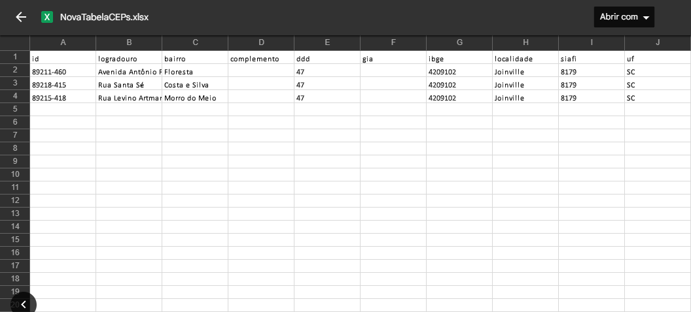

  

# Buscar endereço por CEP

Utilizando a API da viacep, um usuário pode realizar buscas de endereços apenas com o número do CEP e exportar esses dados para um arquivo XLSX.

### Utilização da aplicação web:

  
  

